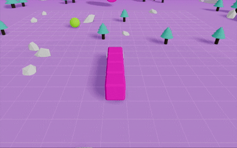

# 3D Snake Game

This is a 3D snake game project built with Three.js, re-architected with a modern front-end tech stack to achieve modular and maintainable game logic decoupled from the UI.

**[Click Here to Try!](https://joyjoy998.github.io/3d-snake-game/)**

## Tech Stack & Architecture

- **Core Tech Stack**: **Three.js** is used for 3D model creation, scene rendering, and physics simulation.

- **Game Architecture**: Built using a Class-based programming approach. Each game entity, such as Snake, Food, and Obstacles, is abstracted into its own `Entity` class, and all game logic is managed by the `GameControl` class, ensuring high cohesion and low coupling.

- **Frontend Framework**: **React** is responsible for rendering UI components and managing lifecycle logic, while keeping the game canvas isolated from UI layers such as the palette panel and control buttons. This clear separation between rendering (React) and core game logic (GameControl) improves modularity, performance, and maintainability.

- **State Management**: **Zustand** serves as a lightweight bridge between React and the pure JavaScript-based **GameControl**. Through its subscription mechanism, it enables real-time synchronization between the game state (e.g., score, palette, camera mode) and the UI, ensuring a unidirectional, predictable data flow.

- **Styling**: **Tailwind CSS** is used for building component styles quickly and flexibly, simplifying the CSS writing process.

- **Automated Deployment**: Integrated **GitHub Actions** to automate project deployment to **GitHub Pages**, which significantly enhances development efficiency.

## Gameplay & Features

1. **Head Follow Mode**: In addition to the traditional fixed bird's-eye view, players can press the `R Key` to enter this mode. In this dynamic view, the camera tracks the snake's head, eliminating blind spots and helping to avoid collisions with hidden obstacles.

   

2. **Tactical Side View**: While in **Head Follow Mode**, pressing the `T Key` switches the view to another side angle, providing a more comprehensive perspective for observing obstacles and planning routes.

   

3. **Dynamic Difficulty Scaling**: As the score increases, the game difficulty escalates linearly. More obstacles are randomly generated, and the snake's speed increases, offering a continuous challenge to the player.

   

4. **Mobile Adaptation**: On mobile devices, the game's difficulty has been reduced, and steering sensitivity has been optimized for touch-based controls. Additionally, to streamline the gameplay, the snake head-follow mode feature has been removed from the mobile version.

   

## Acknowledgements

The inspiration for this **Project Refactoring** came from [Gianluca Lomarco](https://www.youtube.com/watch?v=20WfN0oUXV8). I was profoundly impressed after seeing his amazing implementation of a 3D Snake game using pure JavaScript. At that moment, I decided to rebuild the project with my own vision, using React and modular JavaScript, and to develop new gameplay features on top of the original functionality. Although the project was put on hold for over half a year due to the pressures of my graduation project, I never lost the determination to finish it.

This project is not only a way to make up for a past regret but also an opportunity to summarize and challenge my own technical skills. I am grateful for this journey, which allowed me to turn my initial idea into reality.
